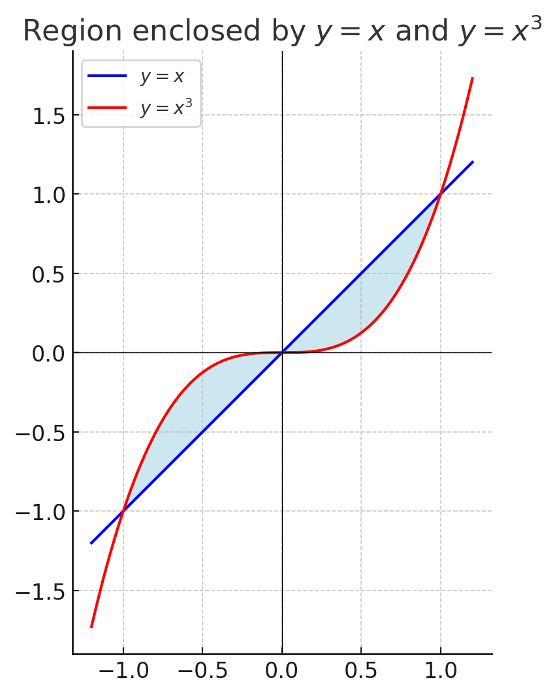

# Assignment 3
## 1.  Evaluate the integral $\int_{1}^{4}\frac{\sqrt{y}-y}{y^{2}} dy$
We simplify the integrand first:

$$
\frac{\sqrt{y}-y}{y^{2}}=y^{-3/2}-y^{-1}.
$$

So

$$
\int_{1}^{4}\left(y^{-3/2}-y^{-1}\right)\,dy
=\int_{1}^{4}y^{-3/2}\,dy-\int_{1}^{4}y^{-1}\,dy.
$$

Compute each antiderivative:

$$
\int y^{-3/2}\,dy=\frac{y^{-1/2}}{-1/2}=-2y^{-1/2},\qquad
\int y^{-1}\,dy=\ln y.
$$

Thus

$$
\int_{1}^{4}\left(y^{-3/2}-y^{-1}\right)\,dy=\Big[-2y^{-1/2}-\ln y\Big]_{1}^{4}.
$$

Evaluate:

$$
\big(-2\cdot\tfrac{1}{\sqrt{4}}-\ln 4\big)-\big(-2\cdot1-\ln 1\big)=(-1-\ln4)-(-2)=1-\ln4.
$$

Since $\ln4=2\ln2$, the final answer is

$$
\boxed{\,1-2\ln 2\,}.
$$

## 2. Sketch the region enclosed by the given curves $y = x ^ 3$ $y = x$ and find its area.

**Intersection points:**
Solve $x^3=x\Rightarrow x(x^2-1)=0$. So $x=-1,0,1$. These are the x-values where the curves meet.

**Which curve is on top?**

* For $x\in(-1,0)$, pick $x=-0.5$: $x^3=-0.125$, $x=-0.5$. So $x^3>x$ — the cubic is above the line on $[-1,0]$.
* For $x\in(0,1)$, pick $x=0.5$: $x^3=0.125$, $x=0.5$. So $x>x^3$ — the line is above the cubic on $[0,1]$.

So the bounded region consists of two symmetric lobes between $x=-1$ and $x=1$.

**Area:**
Total area $A=\displaystyle\int_{-1}^{1}\big|x-x^{3}\big|\,dx$. By symmetry the two halves are equal, so

$$
A=2\int_{0}^{1}(x-x^{3})\,dx.
$$

Compute:

$$
\int_{0}^{1}(x-x^{3})\,dx=\Big[\tfrac{1}{2}x^{2}-\tfrac{1}{4}x^{4}\Big]_{0}^{1}
=\tfrac{1}{2}-\tfrac{1}{4}=\tfrac{1}{4}.
$$

Hence

$$
\boxed{\,A=2\cdot\tfrac{1}{4}=\tfrac{1}{2}\,.}
$$

## 3. Evaluate the indefinite integral $\int u \sqrt{1 - u^2}\,du$
We want to evaluate

$$
I = \int u \sqrt{1 - u^2}\,du
$$

---

### Step 1: Substitution

Let

$$
t = 1 - u^2 \quad \Rightarrow \quad dt = -2u\,du \quad \Rightarrow \quad u\,du = -\tfrac{1}{2} dt
$$

---

### Step 2: Rewrite integral

$$
I = \int u \sqrt{1 - u^2}\,du
= \int \sqrt{t}\,(-\tfrac{1}{2} dt)
= -\tfrac{1}{2} \int t^{1/2} \, dt
$$

---

### Step 3: Integrate

$$
-\tfrac{1}{2} \cdot \frac{2}{3} t^{3/2} + C
= -\tfrac{1}{3} (1 - u^2)^{3/2} + C
$$

---

**Final Answer:**

$$
\int u \sqrt{1 - u^2}\,du = -\tfrac{1}{3} (1 - u^2)^{3/2} + C
$$

## 4.  A particle is moved along the x-axis by a force that measures $\frac{10}{(1+x)^2}$ pounds at a point $x$ feet from the origin. Find the work done in moving the particle from the origin to a distance of $9$ ft

We’re asked to compute the **work done** by a variable force.

#### Step 1: Recall formula

Work is the integral of force along displacement:

$$
W = \int_{a}^{b} F(x)\, dx
$$

Here, $F(x) = \frac{10}{(1+x)^2}$, and the particle moves from $x=0$ to $x=9$.

---

#### Step 2: Set up the integral

$$
W = \int_{0}^{9} \frac{10}{(1+x)^2}\, dx
$$

---

#### Step 3: Solve

Factor out the constant:

$$
W = 10 \int_{0}^{9} \frac{1}{(1+x)^2}\, dx
$$

Let $u = 1+x \;\;\Rightarrow\;\; du = dx$.
When $x=0$, $u=1$.
When $x=9$, $u=10$.

So:

$$
W = 10 \int_{1}^{10} \frac{1}{u^2}\,du
$$

$$
= 10 \left[ -\frac{1}{u} \right]_{1}^{10}
= 10 \left( -\frac{1}{10} + \frac{1}{1} \right)
$$

$$
= 10 \left( \frac{9}{10} \right) = 9
$$

**Final Answer:**

$$
\text{Work done} = 9 \;\text{foot-pounds}
$$

## 5.  Find a substitution and then use integration by parts to evaluate the integral $\displaystyle \int t^{3}e^{-t^{2}}\,dt$.
We want $\displaystyle \int t^{3}e^{-t^{2}}\,dt$.

#### Step 1 — Substitution

Set $w=t^{2}$. Then $dw=2t\,dt$ so $t\,dt=\tfrac{1}{2}dw$. Also $t^{2}=w$. Thus

$$
\int t^{3}e^{-t^{2}}\,dt=\int t^{2}\,(t e^{-t^{2}})\,dt
=\int w\,e^{-w}\cdot\frac{1}{2}\,dw
=\tfrac{1}{2}\int w e^{-w}\,dw.
$$

#### Step 2 — Integration by parts

For $\int w e^{-w}\,dw$ take

$$
U=w,\quad dV=e^{-w}dw\quad\Rightarrow\quad dU=dw,\quad V=-e^{-w}.
$$

So

$$
\int w e^{-w}\,dw = UV-\int V\,dU = -w e^{-w} -\int(-e^{-w})\,dw
= -w e^{-w} - e^{-w} + C
= -(w+1)e^{-w}+C.
$$

Multiply by $\tfrac{1}{2}$ and substitute back $w=t^{2}$:

$$
\int t^{3}e^{-t^{2}}\,dt = -\tfrac{1}{2}(t^{2}+1)e^{-t^{2}} + C.
$$

#### Final answer

$$
\boxed{\;\displaystyle \int t^{3}e^{-t^{2}}\,dt = -\tfrac{1}{2}(t^{2}+1)e^{-t^{2}} + C\; }
$$

## 6. Evaluate the integral $\int \tan x \, \sec^3 x \, dx$
We want to evaluate

$$
I = \int \tan x \, \sec^3 x \, dx
$$

#### Step 1 — Recall relations

* $\tan x = \dfrac{\sin x}{\cos x}$
* $\sec x = \dfrac{1}{\cos x}$, so $\sec^3 x = \dfrac{1}{\cos^3 x}$.

Thus

$$
\tan x \sec^3 x = \frac{\sin x}{\cos x} \cdot \frac{1}{\cos^3 x}
= \frac{\sin x}{\cos^4 x}.
$$

So

$$
I = \int \frac{\sin x}{\cos^4 x}\, dx.
$$

#### Step 2 — Substitution

Let $u = \cos x \;\Rightarrow\; du = -\sin x \, dx$.

So:

$$
I = \int \frac{\sin x}{\cos^4 x} \, dx
= \int \frac{-du}{u^4}.
$$

#### Step 3 — Simplify integral

$$
I = -\int u^{-4}\, du = -\frac{u^{-3}}{-3} + C
= \frac{1}{3}u^{-3} + C.
$$

#### Step 4 — Back-substitute

$$
I = \frac{1}{3}\sec^3 x + C.
$$

**Final Answer:**

$$
\int \tan x \, \sec^3 x \, dx = \tfrac{1}{3}\sec^3 x + C
$$

## 7. Approximate the integral $\int_{1}^{4} \sqrt{\ln x}\, dx$ By using (a) The Trapezoidal Rule, (b) The Midpoint rule, (c) Simpson's Rule to approximate the given integral with the specified value of $n$. (Round your answer to six decimal places.)

### (a) Trapezoidal Rule
$$
I = \int_{1}^{4} \sqrt{\ln x}\, dx
$$

#### **Step 1: Formula**

For $n$ subintervals of width $h=\frac{b-a}{n}$,

$$
T = h\left[\tfrac{1}{2}f(x_0) + f(x_1)+f(x_2)+\cdots+f(x_{n-1})+\tfrac{1}{2}f(x_n)\right].
$$

#### **Step 2: Interval and Step Size**

$$
a=1, \quad b=4, \quad n=6, \quad h=\frac{4-1}{6}=0.5
$$

So the points are:

$$
x_0=1, \, x_1=1.5, \, x_2=2, \, x_3=2.5, \, x_4=3, \, x_5=3.5, \, x_6=4.
$$

#### **Step 3: Compute $f(x)=\sqrt{\ln x}$ at each point**

$$
\begin{aligned}
f(x_0) &= \sqrt{\ln(1)} = 0, \\
f(x_1) &= \sqrt{\ln(1.5)} \approx 0.636893, \\
f(x_2) &= \sqrt{\ln(2)} \approx 0.832555, \\
f(x_3) &= \sqrt{\ln(2.5)} \approx 0.957502, \\
f(x_4) &= \sqrt{\ln(3)} \approx 1.048148, \\
f(x_5) &= \sqrt{\ln(3.5)} \approx 1.120176, \\
f(x_6) &= \sqrt{\ln(4)} \approx 1.177410.
\end{aligned}
$$

#### **Step 4: Plug into Trapezoidal formula**

$$
T = 0.5\left[\tfrac{1}{2}f(x_0) + f(x_1)+f(x_2)+f(x_3)+f(x_4)+f(x_5)+\tfrac{1}{2}f(x_6)\right]
$$

Substitute values:

$$
T = 0.5\left[\tfrac{1}{2}(0) + (0.636893+0.832555+0.957502+1.048148+1.120176) + \tfrac{1}{2}(1.177410)\right].
$$

---

#### **Step 5: Simplify**

$$
= 0.5\left[0 + 4.595274 + 0.588705\right]
$$

$$
= 0.5(5.183979) = 2.591334
$$

### (b) Midpoint Rule
$$
I=\int_{1}^{4}\sqrt{\ln x}\,dx, \quad n=6
$$

#### Step 1: Partition

The interval is $[1,4]$, so total length:

$$
b-a=4-1=3
$$

Step size:

$$
h=\frac{b-a}{n}=\frac{3}{6}=0.5
$$

So subintervals are:

$$
[1,1.5], [1.5,2], [2,2.5], [2.5,3], [3,3.5], [3.5,4]
$$

#### Step 2: Midpoints of each subinterval

For midpoint rule we use

$$
x_i^* = x_{i-1}+\frac{h}{2}
$$

So:

* $x_1^* = 1+0.25=1.25$
* $x_2^* = 1.5+0.25=1.75$
* $x_3^* = 2+0.25=2.25$
* $x_4^* = 2.5+0.25=2.75$
* $x_5^* = 3+0.25=3.25$
* $x_6^* = 3.5+0.25=3.75$

#### Step 3: Function values

We need

$$
f(x)=\sqrt{\ln x}
$$

Compute at midpoints:

* $f(1.25)=\sqrt{\ln(1.25)}\approx \sqrt{0.2231}=0.4727$
* $f(1.75)=\sqrt{\ln(1.75)}\approx \sqrt{0.5596}=0.7481$
* $f(2.25)=\sqrt{\ln(2.25)}\approx \sqrt{0.8109}=0.9005$
* $f(2.75)=\sqrt{\ln(2.75)}\approx \sqrt{1.0116}=1.0058$
* $f(3.25)=\sqrt{\ln(3.25)}\approx \sqrt{1.1787}=1.0857$
* $f(3.75)=\sqrt{\ln(3.75)}\approx \sqrt{1.3218}=1.1496$

#### Step 4: Apply the midpoint rule formula

$$
M_n = h\sum_{i=1}^{n} f(x_i^*)
$$

So:

$$
M_6 = 0.5\Big[f(1.25)+f(1.75)+f(2.25)+f(2.75)+f(3.25)+f(3.75)\Big]
$$

$$
M_6 = 0.5\Big(0.4727+0.7481+0.9005+1.0058+1.0857+1.1496\Big)
$$

$$
M_6 = 0.5(5.3624)=2.6812
$$

#### Final Answer

$$
\int_{1}^{4}\sqrt{\ln x}\,dx \approx 2.681046 \quad \text{(Midpoint Rule, \(n=6\))}
$$

### (c) Simpson's Rule
Great! Let’s carefully work out **Simpson’s Rule** step by step for

$$
I=\int_{1}^{4} \sqrt{\ln x}\, dx, \quad n=6.
$$

#### **Step 1: Set up the interval and step size**

We are integrating over $[1,4]$ with $n=6$ subintervals.

$$
h = \frac{4-1}{6} = \frac{3}{6} = 0.5
$$

So the partition points are:

$$
x_0=1,\; x_1=1.5,\; x_2=2.0,\; x_3=2.5,\; x_4=3.0,\; x_5=3.5,\; x_6=4.0
$$

#### **Step 2: Compute function values**

$$
f(x)=\sqrt{\ln x}
$$

* $f(x_0)=\sqrt{\ln 1}=0$
* $f(x_1)=\sqrt{\ln 1.5} \approx 0.6368$
* $f(x_2)=\sqrt{\ln 2} \approx 0.8326$
* $f(x_3)=\sqrt{\ln 2.5} \approx 0.9575$
* $f(x_4)=\sqrt{\ln 3} \approx 1.0481$
* $f(x_5)=\sqrt{\ln 3.5} \approx 1.1183$
* $f(x_6)=\sqrt{\ln 4} \approx 1.1774$

#### **Step 3: Apply Simpson’s Rule formula**

$$
S = \frac{h}{3} \left[ f(x_0) + f(x_6) + 4\big(f(x_1)+f(x_3)+f(x_5)\big) + 2\big(f(x_2)+f(x_4)\big)\right]
$$

Substitute values:

$$
S = \frac{0.5}{3}\Big[0 + 1.1774 + 4(0.6368+0.9575+1.1183) + 2(0.8326+1.0481)\Big]
$$

#### **Step 4: Simplify inside**

* Odd terms: $0.6368+0.9575+1.1183 = 2.7126$
  Multiply by 4 → $10.8504$
* Even terms: $0.8326+1.0481 = 1.8807$
  Multiply by 2 → $3.7614$
* Endpoints: $0+1.1774 = 1.1774$

Total inside brackets:

$$
1.1774 + 10.8504 + 3.7614 = 15.7892
$$

#### **Step 5: Multiply by $\tfrac{h}{3}=\tfrac{0.5}{3}=0.1667$**

$$
S = 0.1667 \times 15.7892 \approx 2.631976
$$

**Final Answer (Simpson’s Rule, $n=6$)**:

$$
\int_{1}^{4} \sqrt{\ln x}\, dx \;\approx\; \boxed{2.631976}
$$

## 8. Find the area of the region bounded by the given curves $y=sin^3x$ and $y = cos^3x$, $\frac{\pi}{4} \le x \le \frac{5\pi}{4}$.
We want the area between $y=\sin^3x$ and $y=\cos^3x$ on $\displaystyle \left[\frac{\pi}{4},\frac{5\pi}{4}\right]$.

#### 1. Which curve is on top?

Consider

$$
h(x)=\sin^3x-\cos^3x=(\sin x-\cos x)(\sin^2x+\sin x\cos x+\cos^2x).
$$

Since $\sin^2x+\sin x\cos x+\cos^2x=1+\sin x\cos x$ and $\sin x\cos x\in[-\tfrac12,\tfrac12]$, we have $1+\sin x\cos x>0$ on the whole interval. Thus the sign of $h(x)$ equals the sign of $\sin x-\cos x=\sqrt2\sin\!\big(x-\tfrac{\pi}{4}\big)$, which is positive for $x\in(\tfrac{\pi}{4},\tfrac{5\pi}{4})$. So on the open interval $\sin^3x>\cos^3x$ and they meet at the endpoints. Therefore the area is

$$
A=\int_{\pi/4}^{5\pi/4}\big(\sin^3x-\cos^3x\big)\,dx.
$$

#### 2. Antiderivatives

Use standard integrals:

$$
\int \sin^3x\,dx = -\cos x + \tfrac{1}{3}\cos^3x + C,
\qquad
\int \cos^3x\,dx = \sin x - \tfrac{1}{3}\sin^3x + C.
$$

So an antiderivative for the integrand is

$$
F(x)=\big(-\cos x+\tfrac{1}{3}\cos^3x\big)-\big(\sin x-\tfrac{1}{3}\sin^3x\big)
= -\cos x-\sin x + \tfrac{1}{3}\big(\cos^3x+\sin^3x\big).
$$

#### 3. Evaluate at the bounds

At $x=\pi/4$: $\sin x=\cos x=s=\tfrac{\sqrt2}{2}$, so

$$
F\!\big(\tfrac{\pi}{4}\big) = -2s + \tfrac{2}{3}s^3.
$$

At $x=5\pi/4$: $\sin x=\cos x=-s$, so

$$
F\!\big(\tfrac{5\pi}{4}\big) = 2s - \tfrac{2}{3}s^3.
$$

Hence

$$
A=F\!\big(\tfrac{5\pi}{4}\big)-F\!\big(\tfrac{\pi}{4}\big)
= \big(2s-\tfrac{2}{3}s^3\big) - \big(-2s+\tfrac{2}{3}s^3\big)
=4s - \tfrac{4}{3}s^3.
$$

With $s=\tfrac{\sqrt2}{2}$ we have $s^3=\tfrac{\sqrt2}{4}$. Therefore

$$
A = 4\cdot\frac{\sqrt2}{2} - \frac{4}{3}\cdot\frac{\sqrt2}{4}
=2\sqrt2 - \frac{1}{3}\sqrt2
=\frac{5}{3}\sqrt2.
$$

#### Final answer

$$
\boxed{\,A=\frac{5\sqrt2}{3}\, \approx 2.357023\,.}
$$

## 9. Find the volume of the solid obtained by rotating the region bounded by the given curve $y=x^3$ $y=x$, $x \ge 0$ about the x-axis. Sketch the region, the solid,and a typical disk or washer.

Region: bounded by $y=x^3$ and $y=x$ for $x\in[0,1]$ (they meet at $x=0,1$).
Rotate about the $x$-axis. For $0<x<1$ we have $x>x^3$, so the outer radius is $R(x)=x$ and inner radius is $r(x)=x^3$.

Using the washer method:

$$
V=\pi\int_{0}^{1}\big(R(x)^2-r(x)^2\big)\,dx
=\pi\int_{0}^{1}\big(x^{2}-x^{6}\big)\,dx.
$$

Compute the integral:

$$
\int_{0}^{1}(x^{2}-x^{6})\,dx=\left[\frac{x^{3}}{3}-\frac{x^{7}}{7}\right]_{0}^{1}
=\frac{1}{3}-\frac{1}{7}=\frac{4}{21}.
$$

So the volume is

$$
\boxed{\,V=\frac{4\pi}{21}\,}.
$$

## 10. Determine whether each integral \int_{0}^{1}\frac{e^{1/x}}{x^{3}}\,dx is convergent or divergent. Evaluate the integral value if it is convergent

We have the improper integral

$$
\int_{0}^{1}\frac{e^{1/x}}{x^{3}}\,dx,
$$

which is improper at $x=0$. Make the substitution $u=\dfrac{1}{x}$. Then $x=\dfrac{1}{u}$, $dx=-\dfrac{1}{u^{2}}\,du$. When $x\to0^+$ we have $u\to+\infty$; when $x=1$ we have $u=1$. The integral becomes

$$
\int_{0}^{1}\frac{e^{1/x}}{x^{3}}\,dx
= \int_{\infty}^{1} e^{u}\,\frac{1}{(1/u)^{3}}\left(-\frac{1}{u^{2}}\right)\,du
= \int_{\infty}^{1} -u e^{u}\,du
= \int_{1}^{\infty} u e^{u}\,du.
$$

Compute the antiderivative:

$$
\int u e^{u}\,du = u e^{u}-\int e^{u}\,du = (u-1)e^{u}+C.
$$

So

$$
\int_{1}^{\infty} u e^{u}\,du = \lim_{b\to\infty}\big[(u-1)e^{u}\big]_{1}^{b}
= \lim_{b\to\infty} (b-1)e^{b} - (1-1)e^{1}
= \lim_{b\to\infty} (b-1)e^{b}.
$$

Because $(b-1)e^{b}\to\infty$ as $b\to\infty$, the integral diverges (in fact it diverges to $+\infty$). Therefore the original integral is **divergent** (does not converge to a finite value).
