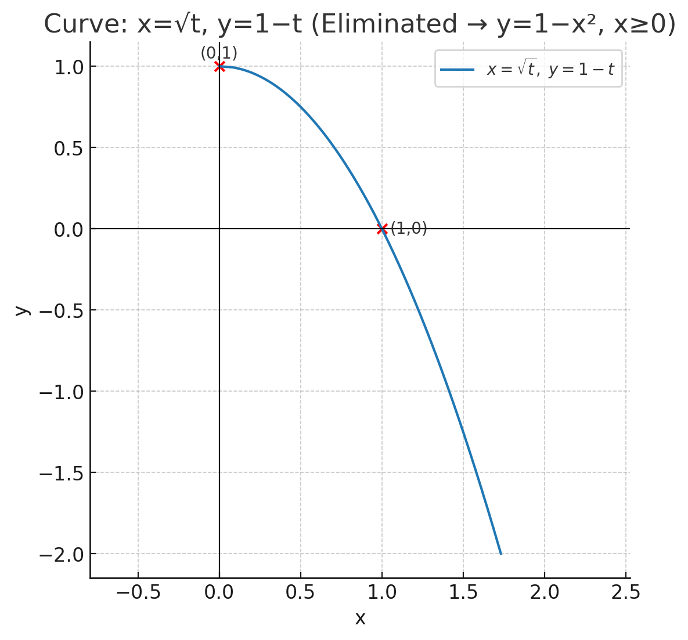

# Assignment 4
## 1. Determine whether the integral $\int_{2}^{3}\frac{1}{\sqrt{3-x}}\,dx$ is convergent or divergent. Evaluate the integral value if it is convergent.
The integral is improper at $x=3$ because $\sqrt{3-x}\to 0^+$.

$$
\int_{2}^{3}\frac{dx}{\sqrt{3-x}}
=\lim_{b\to 3^-}\int_{2}^{b}(3-x)^{-1/2}\,dx
$$

An antiderivative is $-2\sqrt{3-x}$. So

$$
\lim_{b\to 3^-}\Big[-2\sqrt{3-x}\Big]_{2}^{b}
=\lim_{b\to 3^-}\left(-2\sqrt{3-b}+2\sqrt{1}\right)=2.
$$

**Conclusion:** The integral is **convergent**, and its value is $\boxed{2}$.

## 2. Find the exact length of the curve $y = ln(1 - x ^ 2)$, $0 \le x \le \pi\frac{1}{2}$.
**Arc length:**

$$
L=\int_{0}^{1/2}\sqrt{1+\left(\frac{dy}{dx}\right)^2}\,dx.
$$

Compute $y'$:

$$
y'=\frac{d}{dx}\ln(1-x^2)=\frac{-2x}{1-x^2}.
$$

So

$$
1+(y')^2
=1+\frac{4x^2}{(1-x^2)^2}
=\frac{(1-x^2)^2+4x^2}{(1-x^2)^2}
=\frac{1+2x^2+x^4}{(1-x^2)^2}
=\frac{(1+x^2)^2}{(1-x^2)^2}.
$$

Hence

$$
\sqrt{1+(y')^2}=\frac{1+x^2}{1-x^2}\quad(0\le x<1).
$$

Therefore

$$
L=\int_0^{1/2}\frac{1+x^2}{1-x^2}\,dx
=\int_0^{1/2}\!\left(-1+\frac{2}{1-x^2}\right)\!dx
=\Big[-x-\ln(1-x)+\ln(1+x)\Big]_{0}^{1/2}.
$$

Evaluate:

$$
L=\left(-\tfrac12-\ln\tfrac12+\ln\tfrac32\right)-0
=-\tfrac12+\ln\!\left(\frac{3/2}{1/2}\right)
=-\tfrac12+\ln 3.
$$

$$
\boxed{L=\ln 3-\tfrac12}.
$$

## 3. Use Simpson's Rule with $n = 10$ to estimate the arc length of the curve $y=e ^{-x^2}$, $0 \le x \le 2$
We want the arc length

$$
L=\int_{0}^{2}\sqrt{1+\big(y'(x)\big)^2}\,dx,\qquad y=e^{-x^2},\; y'=-2x e^{-x^2},
$$

so the integrand is

$$
f(x)=\sqrt{1+4x^2e^{-2x^2}}.
$$

Use Simpson's rule with $n=10$ ($h=(2-0)/10=0.2$). The node values $x_i$ and $f(x_i)$ are:

| $i$ | $x_i$ | $f(x_i)=\sqrt{1+4x_i^2e^{-2x_i^2}}$ |
| --: | ----: | ----------------------------------: |
|   0 |   0.0 |                        1.0000000000 |
|   1 |   0.2 |                        1.0713069660 |
|   2 |   0.4 |                        1.2102625268 |
|   3 |   0.6 |                        1.3041944827 |
|   4 |   0.8 |                        1.3083483822 |
|   5 |   1.0 |                        1.2415076049 |
|   6 |   1.2 |                        1.1503635225 |
|   7 |   1.4 |                        1.0749670613 |
|   8 |   1.6 |                        1.0301429388 |
|   9 |   1.8 |                        1.0098901853 |
|  10 |   2.0 |                        1.0026801095 |

Apply Simpson's rule:

$$
L\approx \frac{h}{3}\Big(f_0+f_{10}+4\sum_{odd}f_i+2\sum_{even,\,2\le i\le8}f_i\Big).
$$

Carrying out the sums gives

$$
L_{\text{Simpson},\,n=10}\approx 2.2805586700.
$$

Rounded reasonably,

$$
\boxed{L\approx 2.28056.}
$$

## 4. The given curve $y = 1 - x ^ 2$, $0 \le x \le 1$ is rotated about the y-axis. Find the area of the resulting surface.
Surface area for rotating $y=f(x)$ about the $y$-axis (with $x$ from $a$ to $b$) is

$$
S=2\pi\int_a^b x\sqrt{1+\big(f'(x)\big)^2}\,dx.
$$

Here $f(x)=1-x^2,\;0\le x\le1$. So $f'(x)=-2x$ and

$$
S=2\pi\int_{0}^{1} x\sqrt{1+4x^2}\,dx.
$$

Let $u=1+4x^2$, so $du=8x\,dx$ and when $x=0$ to $1$, $u$ goes $1$ to $5$. Hence

$$
S=2\pi\int_{1}^{5}\frac{1}{8}\sqrt{u}\,du
=\frac{\pi}{6}\Big[u^{3/2}\Big]_{1}^{5}
=\frac{\pi}{6}\big(5^{3/2}-1\big).
$$

Since $5^{3/2}=5\sqrt5$, the exact surface area is

$$
\boxed{S=\frac{\pi}{6}\big(5\sqrt5-1\big).}
$$

Numerical value: $S\approx 5.3304135003$.

## 5. Sketch the curve of the parametric equations $x = \sqrt{t}$ and $y = 1 - t$ by eliminating the parameter.

## 6. Find the exact length of the curve $x = t\sin{t}$ and $y = t\cos{t}$;  $0 \le t \le 1$.
Nice one — the speed simplifies beautifully.

$$
\frac{dx}{dt}=\sin t+t\cos t,\qquad \frac{dy}{dt}=\cos t-t\sin t
$$

so

$$
\Big(\frac{dx}{dt}\Big)^2+\Big(\frac{dy}{dt}\Big)^2
= (\sin^2t+\cos^2t) + t^2(\cos^2t+\sin^2t)=1+t^2.
$$

Thus the arc length is

$$
L=\int_0^1\sqrt{1+t^2}\,dt.
$$

Use the standard antiderivative

$$
\int\sqrt{1+t^2}\,dt=\frac{t\sqrt{1+t^2}}{2}+\frac{1}{2}\ln\!\big(t+\sqrt{1+t^2}\big)+C,
$$

so

$$
L=\left[\frac{t\sqrt{1+t^2}}{2}+\frac{1}{2}\ln\!\big(t+\sqrt{1+t^2}\big)\right]_0^1
=\frac{\sqrt2}{2}+\frac{1}{2}\ln(1+\sqrt2).
$$

$$
\boxed{\,L=\frac{\sqrt2+\ln(1+\sqrt2)}{2}\approx 1.1477935747\,}
$$

## 7. Determine whether the sequence converges or diverges. If it converges, find the limit $a_n = \frac{(-3) ^ n}{n!}$ .
Consider the absolute value $|a_n|=\dfrac{3^n}{n!}$. Compute the ratio

$$
\frac{|a_{n+1}|}{|a_n|}=\frac{3^{\,n+1}/(n+1)!}{3^n/n!}=\frac{3}{n+1}\xrightarrow[n\to\infty]{}0.
$$

Since the ratio tends to $0<1$, $|a_n|\to0$, so $a_n\to0$ as $n\to\infty$. Equivalently, factorial growth dominates exponential growth, forcing the terms to vanish.

$$
\boxed{\lim_{n\to\infty}\frac{(-3)^n}{n!}=0.}
$$

## 8. Find a formula for the general term $a_n$ of the sequence, assuming that the pattern of the first few terms continues $\lbrace 1, \frac{1}{3}, \frac{1}{5}, \frac{1}{7}, \frac{1}{9}...\rbrace$
We see the sequence:

$$
a_1=\tfrac{1}{1},\quad a_2=\tfrac{1}{3},\quad a_3=\tfrac{1}{5},\quad a_4=\tfrac{1}{7},\quad a_5=\tfrac{1}{9},\dots
$$

The denominators are the odd numbers: $1,3,5,7,9,\dots$ which can be written as $2n-1$.

So the general term is

$$
\boxed{a_n = \frac{1}{2n-1}}, \quad n=1,2,3,\dots
$$

## 9. Find the Maclaurin series for $f(x) = \cos{3x}$ and find the associated radius of convergence.
Maclaurin series: $f(x)=\sum_{k=0}^\infty \dfrac{f^{(k)}(0)}{k!}x^k.$

For $f(x)=\cos(3x)$ compute derivatives and evaluate at $0$:

$$
\begin{aligned}
f(x)&=\cos(3x), & f(0)&=1,\\
f'(x)&=-3\sin(3x), & f'(0)&=0,\\
f''(x)&=-9\cos(3x), & f''(0)&=-9,\\
f^{(3)}(x)&=27\sin(3x), & f^{(3)}(0)&=0,\\
f^{(4)}(x)&=81\cos(3x), & f^{(4)}(0)&=81,
\end{aligned}
$$

and so on. In general $f^{(2n)}(0)=(-1)^n3^{2n}$ and $f^{(2n+1)}(0)=0$. Therefore

$$
\cos(3x)=\sum_{n=0}^\infty\frac{f^{(2n)}(0)}{(2n)!}x^{2n}
=\sum_{n=0}^\infty\frac{(-1)^n 3^{2n}x^{2n}}{(2n)!},
$$

which matches Method 1.

### Radius of convergence

Apply the ratio test to the general term $a_n=\dfrac{3^{2n}x^{2n}}{(2n)!}$:

$$
\frac{|a_{n+1}|}{|a_n|}
=\frac{3^{2(n+1)}|x|^{2(n+1)}/(2n+2)!}{3^{2n}|x|^{2n}/(2n)!}
=\frac{9x^2}{(2n+2)(2n+1)}\xrightarrow[n\to\infty]{}0.
$$

Since the limit is $0$ for every fixed $x$, the series converges for all real $x$. Hence the radius of convergence is

$$
\boxed{R=\infty.}
$$

#### Final answer

$$
\boxed{\displaystyle \cos(3x)=\sum_{n=0}^{\infty}\frac{(-1)^n 3^{2n}x^{2n}}{(2n)!}=1-\frac{9x^2}{2!}+\frac{81x^4}{4!}-\cdots,\quad R=\infty.}
$$

## 10. Find the Taylor polynomial $T_3(x)$ for the function $f(x) = \ln{x}$ centered at $a = 1$.
We want the 3rd-degree Taylor polynomial for $f(x)=\ln x$ about $a=1$.

1. Compute derivatives and evaluate at $x=1$:

$$
\begin{aligned}
f(x)&=\ln x          & f(1)&=0,\\
f'(x)&=\tfrac{1}{x}   & f'(1)&=1,\\
f''(x)&=-\tfrac{1}{x^2} & f''(1)&=-1,\\
f^{(3)}(x)&=\tfrac{2}{x^3} & f^{(3)}(1)&=2.
\end{aligned}
$$

2. Taylor polynomial formula (centered at $a=1$):

$$
T_3(x)=f(1)+f'(1)(x-1)+\frac{f''(1)}{2!}(x-1)^2+\frac{f^{(3)}(1)}{3!}(x-1)^3.
$$

3. Substitute the values:

$$
T_3(x)=0 + 1\cdot(x-1)+\frac{-1}{2}(x-1)^2+\frac{2}{6}(x-1)^3
= (x-1)-\tfrac{1}{2}(x-1)^2+\tfrac{1}{3}(x-1)^3.
$$

$$
\implies T_3(x)=\tfrac{1}{3}x^3-\tfrac{3}{2}x^2+3x-\tfrac{11}{6}.
$$
