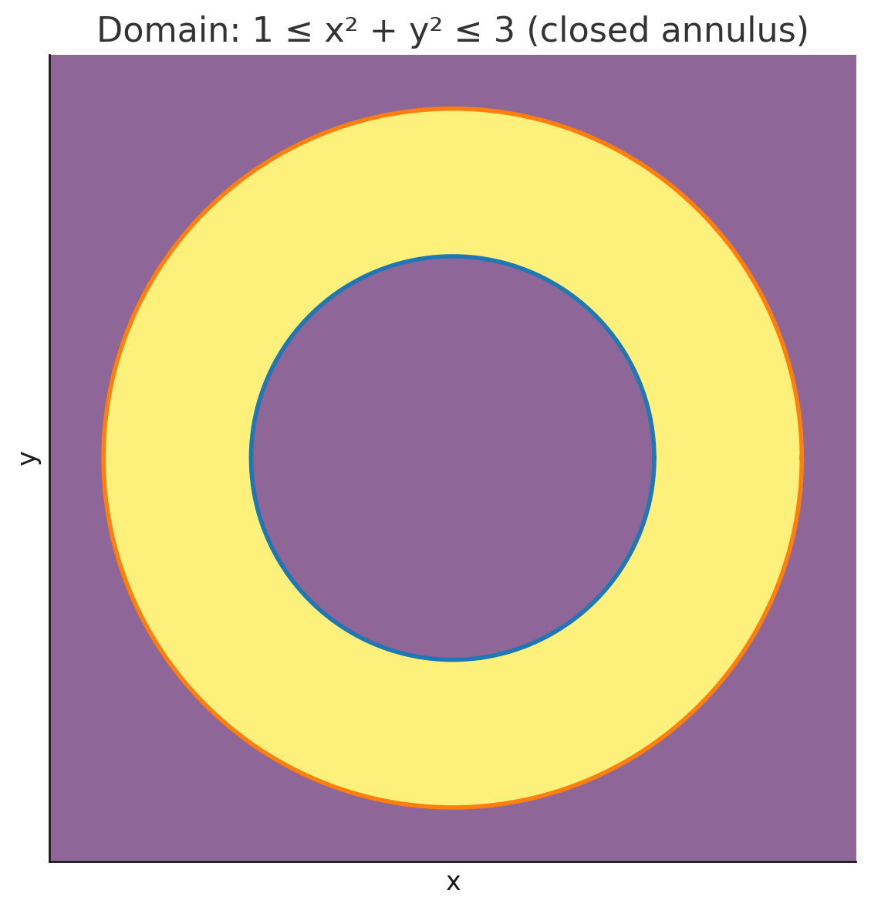

# Assignment 2
## 1. Find and sketch the domain of the function $f(x, y) = \arcsin{(x ^ 2+ y ^ 2 -2)}$
To find and sketch the domain of the function $f(x, y) = \arcsin(x^2 + y^2 - 2)$, we need to determine where the expression inside the arcsine, $x^2 + y^2 - 2$, is within the valid range for the arcsine function.

### Step 1: Understand the domain of the arcsine function

The function $\arcsin(z)$ is only defined for $z$ in the interval $[-1, 1]$, because the arcsine function has the range $[-\frac{\pi}{2}, \frac{\pi}{2}]$, and it's only valid for values of $z$ such that:

$$
-1 \leq z \leq 1
$$

In our case, $z = x^2 + y^2 - 2$, so we need to solve the inequality:

$$
-1 \leq x^2 + y^2 - 2 \leq 1
$$

### Step 2: Solve the inequality

#### First, solve $x^2 + y^2 - 2 \geq -1$:

$$
x^2 + y^2 - 2 \geq -1
$$

$$
x^2 + y^2 \geq 1
$$

This represents a circle of radius 1 centered at the origin.

#### Next, solve $x^2 + y^2 - 2 \leq 1$:

$$
x^2 + y^2 - 2 \leq 1
$$

$$
x^2 + y^2 \leq 3
$$

This represents a circle of radius $\sqrt{3}$ centered at the origin.

### Step 3: Combine the two inequalities

From the two inequalities, we have:

$$
1 \leq x^2 + y^2 \leq 3
$$

This means the domain is the region between two concentric circles:

* The inner circle has radius 1.
* The outer circle has radius $\sqrt{3}$.

Thus, the domain is the **annular region** (or ring-shaped region) between these two circles.

### Step 4: Sketch the domain
This is the domain of the function $f(x, y) = \arcsin(x^2 + y^2 - 2)$.

## 2.  Find the limit, if it exists, or show that the limit does not exist $\lim_{(x, y) \to (0, 0)} \frac{xy}{x^2 + y^2}$
We are tasked with finding the limit:

$$
\lim_{(x, y) \to (0, 0)} \frac{xy}{x^2 + y^2}
$$

To determine whether this limit exists, we will check if the limit gives the same value along different paths approaching the point $(0, 0)$. If the limit is different along different paths, then the limit does not exist.

### Path 1: Along the $x$-axis ($y = 0$)

Along the $x$-axis, we substitute $y = 0$ into the expression:

$$
f(x, 0) = \frac{x(0)}{x^2 + (0)^2} = \frac{0}{x^2} = 0
$$

So, along the $x$-axis, the limit is 0.

### Path 2: Along the $y$-axis ($x = 0$)

Along the $y$-axis, we substitute $x = 0$ into the expression:

$$
f(0, y) = \frac{(0)y}{(0)^2 + y^2} = \frac{0}{y^2} = 0
$$

So, along the $y$-axis, the limit is also 0.

### Path 3: Along the line $y = x$

Now, let's approach along the line $y = x$. Substitute $y = x$ into the expression:

$$
f(x, x) = \frac{x \cdot x}{x^2 + x^2} = \frac{x^2}{2x^2} = \frac{1}{2}
$$

Along this line, the limit is $\frac{1}{2}$.

### Path 4: Along the line $y = -x$

Next, approach along the line $y = -x$. Substitute $y = -x$ into the expression:

$$
f(x, -x) = \frac{x \cdot (-x)}{x^2 + (-x)^2} = \frac{-x^2}{2x^2} = -\frac{1}{2}
$$

Along this line, the limit is $-\frac{1}{2}$.

### Conclusion

The limit along different paths is not the same:

* Along the $x$-axis and the $y$-axis, the limit is 0.
* Along the lines $y = x$ and $y = -x$, the limit is $\frac{1}{2}$ and $-\frac{1}{2}$, respectively.

Since the limit depends on the path taken, **the limit does not exist** at $(0, 0)$.

## 3. Find the indicated partial derivative $\frac{\partial^3 u}{\partial r^2 \partial \theta}$ for $u(r, \theta) = e^{r \theta} \sin \theta$.
We are asked to find the partial derivative $\frac{\partial^3 u}{\partial r^2 \partial \theta}$ for the function:

$$
u(r, \theta) = e^{r \theta} \sin \theta
$$

### Step 1: Compute the first partial derivative with respect to $r$

First, let's compute the partial derivative of $u(r, \theta)$ with respect to $r$.

$$
u(r, \theta) = e^{r \theta} \sin \theta
$$

Taking the partial derivative with respect to $r$:

$$
\frac{\partial u}{\partial r} = \frac{\partial}{\partial r} \left( e^{r \theta} \sin \theta \right)
$$

Since $\sin \theta$ is treated as a constant with respect to $r$, we get:

$$
\frac{\partial u}{\partial r} = \theta e^{r \theta} \sin \theta
$$

### Step 2: Compute the second partial derivative with respect to $r$

Now, take the partial derivative of $\frac{\partial u}{\partial r}$ with respect to $r$:

$$
\frac{\partial^2 u}{\partial r^2} = \frac{\partial}{\partial r} \left( \theta e^{r \theta} \sin \theta \right)
$$

Since $\theta \sin \theta$ is constant with respect to $r$, we get:

$$
\frac{\partial^2 u}{\partial r^2} = \theta^2 e^{r \theta} \sin \theta
$$

### Step 3: Compute the partial derivative with respect to $\theta$

Now, we take the partial derivative of $\frac{\partial^2 u}{\partial r^2}$ with respect to $\theta$:

$$
\frac{\partial^3 u}{\partial r^2 \partial \theta} = \frac{\partial}{\partial \theta} \left( \theta^2 e^{r \theta} \sin \theta \right)
$$

Apply the product rule:

$$
\frac{\partial^3 u}{\partial r^2 \partial \theta} = \frac{\partial}{\partial \theta} \left( \theta^2 \right) e^{r \theta} \sin \theta + \theta^2 \frac{\partial}{\partial \theta} \left( e^{r \theta} \sin \theta \right)
$$

First, compute the derivatives:

1. $\frac{\partial}{\partial \theta} \left( \theta^2 \right) = 2\theta$
2. $\frac{\partial}{\partial \theta} \left( e^{r \theta} \sin \theta \right)$

Using the product rule again for $e^{r \theta} \sin \theta$:

$$
\frac{\partial}{\partial \theta} \left( e^{r \theta} \sin \theta \right) = e^{r \theta} \cos \theta + r e^{r \theta} \sin \theta
$$

Now substitute back into the original expression:

$$
\frac{\partial^3 u}{\partial r^2 \partial \theta} = 2\theta e^{r \theta} \sin \theta + \theta^2 \left( e^{r \theta} \cos \theta + r e^{r \theta} \sin \theta \right)
$$

### Step 4: Simplify the expression

Simplify the expression:

$$
\frac{\partial^3 u}{\partial r^2 \partial \theta} = 2\theta e^{r \theta} \sin \theta + \theta^2 e^{r \theta} \cos \theta + r \theta^2 e^{r \theta} \sin \theta
$$

Thus, the third partial derivative of $u(r, \theta)$ is:

$$
\boxed{\frac{\partial^3 u}{\partial r^2 \partial \theta} = 2\theta e^{r \theta} \sin \theta + \theta^2 e^{r \theta} \cos \theta + r \theta^2 e^{r \theta} \sin \theta}
$$

## 4.  Use implicit differentiation to find $\frac{\partial z}{\partial x}$ and $\frac{\partial z}{\partial y}$ for $e ^ z = xyz$.
We are given the equation $e^z = xyz$, and we are tasked with finding the partial derivatives $\frac{\partial z}{\partial x}$ and $\frac{\partial z}{\partial y}$ using implicit differentiation.

### Step 1: Differentiate with respect to $x$

Start with the equation:

$$
e^z = xyz
$$

Differentiate both sides with respect to $x$, treating $y$ as a constant, and applying the chain rule where necessary.

#### Left-hand side:

$$
\frac{d}{dx} \left( e^z \right) = e^z \frac{\partial z}{\partial x}
$$

#### Right-hand side:

Use the product rule to differentiate $xyz$ with respect to $x$:

$$
\frac{d}{dx} \left( xyz \right) = y z + x y \frac{\partial z}{\partial x}
$$

Now, combine the results:

$$
e^z \frac{\partial z}{\partial x} = y z + x y \frac{\partial z}{\partial x}
$$

### Step 2: Solve for $\frac{\partial z}{\partial x}$

Rearrange the equation to isolate $\frac{\partial z}{\partial x}$:

$$
e^z \frac{\partial z}{\partial x} - x y \frac{\partial z}{\partial x} = y z
$$

Factor out $\frac{\partial z}{\partial x}$:

$$
\left( e^z - x y \right) \frac{\partial z}{\partial x} = y z
$$

Finally, solve for $\frac{\partial z}{\partial x}$:

$$
\frac{\partial z}{\partial x} = \frac{y z}{e^z - x y}
$$

### Step 3: Differentiate with respect to $y$

Now, differentiate the original equation $e^z = xyz$ with respect to $y$, treating $x$ as a constant.

#### Left-hand side:

$$
\frac{d}{dy} \left( e^z \right) = e^z \frac{\partial z}{\partial y}
$$

#### Right-hand side:

Use the product rule to differentiate $xyz$ with respect to $y$:

$$
\frac{d}{dy} \left( xyz \right) = x z + x y \frac{\partial z}{\partial y}
$$

Now, combine the results:

$$
e^z \frac{\partial z}{\partial y} = x z + x y \frac{\partial z}{\partial y}
$$

### Step 4: Solve for $\frac{\partial z}{\partial y}$

Rearrange the equation to isolate $\frac{\partial z}{\partial y}$:

$$
e^z \frac{\partial z}{\partial y} - x y \frac{\partial z}{\partial y} = x z
$$

Factor out $\frac{\partial z}{\partial y}$:

$$
\left( e^z - x y \right) \frac{\partial z}{\partial y} = x z
$$

Finally, solve for $\frac{\partial z}{\partial y}$:

$$
\frac{\partial z}{\partial y} = \frac{x z}{e^z - x y}
$$

### Final Answers:

The partial derivatives are:

$$
\frac{\partial z}{\partial x} = \frac{y z}{e^z - x y}
$$

$$
\frac{\partial z}{\partial y} = \frac{x z}{e^z - x y}
$$

## 5. Explain why the function $f(x, y) = x^2y^2$ is differentiable at $(1, 1)$. Then find the linearization $L(x, y)$ of the function that point.

### Step 1: Check if the function $f(x, y) = x^2 y^2$ is differentiable at the point $(1, 1)$

To show that the function is differentiable at $(1, 1)$, we need to:

1. Verify that the partial derivatives exist at $(1, 1)$.
2. Check if the function is continuous at $(1, 1)$.
3. Ensure that the function satisfies the differentiability condition.

#### Continuity Check:

The function $f(x, y) = x^2 y^2$ is a polynomial in both $x$ and $y$, and polynomials are continuous everywhere. Therefore, the function is continuous at $(1, 1)$.

#### Partial Derivatives:

Next, we compute the partial derivatives of $f(x, y) = x^2 y^2$ with respect to $x$ and $y$.

1. **Partial derivative with respect to $x$**:

$$
\frac{\partial f}{\partial x} = \frac{\partial}{\partial x} (x^2 y^2) = 2x y^2
$$

At $(1, 1)$, this becomes:

$$
\frac{\partial f}{\partial x} (1, 1) = 2(1)(1^2) = 2
$$

2. **Partial derivative with respect to $y$**:

$$
\frac{\partial f}{\partial y} = \frac{\partial}{\partial y} (x^2 y^2) = 2x^2 y
$$

At $(1, 1)$, this becomes:

$$
\frac{\partial f}{\partial y} (1, 1) = 2(1^2)(1) = 2
$$

Since both partial derivatives exist and are continuous at $(1, 1)$, the function is differentiable at that point.

### Step 2: Find the Linearization $L(x, y)$

The linearization $L(x, y)$ of a differentiable function $f(x, y)$ at a point $(a, b)$ is given by:

$$
L(x, y) = f(a, b) + \frac{\partial f}{\partial x} (a, b) (x - a) + \frac{\partial f}{\partial y} (a, b) (y - b)
$$

In this case, we are linearizing at $(1, 1)$.

1. **Evaluate $f(1, 1)$**:

$$
f(1, 1) = (1)^2(1)^2 = 1
$$

2. **Partial derivatives at $(1, 1)$**:

We already found that:

$$
\frac{\partial f}{\partial x} (1, 1) = 2 \quad \text{and} \quad \frac{\partial f}{\partial y} (1, 1) = 2
$$

3. **Linearization formula**:

Now, using the linearization formula:

$$
L(x, y) = f(1, 1) + \frac{\partial f}{\partial x} (1, 1) (x - 1) + \frac{\partial f}{\partial y} (1, 1) (y - 1)
$$

Substitute the values:

$$
L(x, y) = 1 + 2(x - 1) + 2(y - 1)
$$

Simplify:

$$
L(x, y) = 1 + 2x - 2 + 2y - 2
$$

$$
L(x, y) = 2x + 2y - 3
$$

### Final Answer:

The function $f(x, y) = x^2 y^2$ is differentiable at $(1, 1)$, and the linearization of the function at $(1, 1)$ is:

$$
L(x, y) = 2x + 2y - 3
$$

## 6. Find the directional derivative of the function $f(x, y, z) = xe^y+ye^z+ze^x$ at the given point $(0,0,0)$ in the direction of the vector $v = \langle 5,1, 2 \rangle$ 
To find the **directional derivative** of the function $f(x, y, z) = x e^y + y e^z + z e^x$ at the point $(0, 0, 0)$ in the direction of the vector $\mathbf{v} = \langle 5, 1, 2 \rangle$, we will use the following formula for the directional derivative:

$$
D_{\mathbf{v}} f(x, y, z) = \nabla f(x, y, z) \cdot \frac{\mathbf{v}}{|\mathbf{v}|}
$$

where:

* $\nabla f(x, y, z)$ is the gradient of the function $f(x, y, z)$,
* $\mathbf{v}$ is the direction vector,
* $|\mathbf{v}|$ is the magnitude of the direction vector.

### Step 1: Compute the gradient $\nabla f(x, y, z)$

The gradient of $f(x, y, z) = x e^y + y e^z + z e^x$ is given by the vector of partial derivatives with respect to $x$, $y$, and $z$:

$$
\nabla f(x, y, z) = \left( \frac{\partial f}{\partial x}, \frac{\partial f}{\partial y}, \frac{\partial f}{\partial z} \right)
$$

#### 1.1: Compute $\frac{\partial f}{\partial x}$

$$
\frac{\partial f}{\partial x} = \frac{\partial}{\partial x} (x e^y + y e^z + z e^x) = e^y + z e^x
$$

At the point $(0, 0, 0)$, we have:

$$
\frac{\partial f}{\partial x}(0, 0, 0) = e^0 + 0 \cdot e^0 = 1
$$

#### 1.2: Compute $\frac{\partial f}{\partial y}$

$$
\frac{\partial f}{\partial y} = \frac{\partial}{\partial y} (x e^y + y e^z + z e^x) = x e^y + e^z
$$

At the point $(0, 0, 0)$, we have:

$$
\frac{\partial f}{\partial y}(0, 0, 0) = 0 \cdot e^0 + e^0 = 1
$$

#### 1.3: Compute $\frac{\partial f}{\partial z}$

$$
\frac{\partial f}{\partial z} = \frac{\partial}{\partial z} (x e^y + y e^z + z e^x) = y e^z + e^x
$$

At the point $(0, 0, 0)$, we have:

$$
\frac{\partial f}{\partial z}(0, 0, 0) = 0 \cdot e^0 + e^0 = 1
$$

#### Gradient at $(0, 0, 0)$:

So, the gradient of $f(x, y, z)$ at $(0, 0, 0)$ is:

$$
\nabla f(0, 0, 0) = \langle 1, 1, 1 \rangle
$$

### Step 2: Compute the magnitude of $\mathbf{v} = \langle 5, 1, 2 \rangle$

The magnitude of the vector $\mathbf{v} = \langle 5, 1, 2 \rangle$ is:

$$
|\mathbf{v}| = \sqrt{5^2 + 1^2 + 2^2} = \sqrt{25 + 1 + 4} = \sqrt{30}
$$

### Step 3: Normalize the vector $\mathbf{v}$

The unit vector in the direction of $\mathbf{v}$ is:

$$
\hat{\mathbf{v}} = \frac{\mathbf{v}}{|\mathbf{v}|} = \frac{\langle 5, 1, 2 \rangle}{\sqrt{30}} = \left\langle \frac{5}{\sqrt{30}}, \frac{1}{\sqrt{30}}, \frac{2}{\sqrt{30}} \right\rangle
$$

### Step 4: Compute the directional derivative

Now, we compute the directional derivative using the formula:

$$
D_{\mathbf{v}} f(0, 0, 0) = \nabla f(0, 0, 0) \cdot \hat{\mathbf{v}}
$$

Take the dot product of $\langle 1, 1, 1 \rangle$ and $\left\langle \frac{5}{\sqrt{30}}, \frac{1}{\sqrt{30}}, \frac{2}{\sqrt{30}} \right\rangle$:

$$
D_{\mathbf{v}} f(0, 0, 0) = 1 \cdot \frac{5}{\sqrt{30}} + 1 \cdot \frac{1}{\sqrt{30}} + 1 \cdot \frac{2}{\sqrt{30}}
$$

$$
D_{\mathbf{v}} f(0, 0, 0) = \frac{5 + 1 + 2}{\sqrt{30}} = \frac{8}{\sqrt{30}}
$$

### Final Answer:

The directional derivative of $f(x, y, z) = x e^y + y e^z + z e^x$ at $(0, 0, 0)$ in the direction of the vector $\langle 5, 1, 2 \rangle$ is:

$$
D_{\mathbf{v}} f(0, 0, 0) = \frac{8}{\sqrt{30}}
$$

## 7. Find equation of (a) the tangent plane and(b)the normal line to the given surface $x+y+z=e^{xyz}$ at the specified point $(0, 0, 1)$.
We are tasked with finding the equation of:

(a) The **tangent plane** to the surface $x + y + z = e^{xyz}$ at the point $(0, 0, 1)$.

(b) The **normal line** to the surface $x + y + z = e^{xyz}$ at the point $(0, 0, 1)$.

### Step 1: Find the Gradient (Normal Vector)

The **normal vector** to the surface at any point is given by the gradient of the implicit surface equation. The gradient $\nabla f(x, y, z)$ of a function $f(x, y, z) = 0$ is:

$$
\nabla f(x, y, z) = \left( \frac{\partial f}{\partial x}, \frac{\partial f}{\partial y}, \frac{\partial f}{\partial z} \right)
$$

In this case, the surface equation is:

$$
f(x, y, z) = x + y + z - e^{xyz} = 0
$$

We need to compute the partial derivatives of $f(x, y, z)$.

#### Partial Derivative with respect to $x$:

$$
\frac{\partial f}{\partial x} = 1 - \frac{\partial}{\partial x} \left( e^{xyz} \right)
$$

Using the chain rule:

$$
\frac{\partial}{\partial x} \left( e^{xyz} \right) = e^{xyz} \cdot \frac{\partial}{\partial x} \left( xyz \right) = e^{xyz} \cdot (yz)
$$

So:

$$
\frac{\partial f}{\partial x} = 1 - yz e^{xyz}
$$

#### Partial Derivative with respect to $y$:

$$
\frac{\partial f}{\partial y} = 1 - \frac{\partial}{\partial y} \left( e^{xyz} \right)
$$

Using the chain rule:

$$
\frac{\partial}{\partial y} \left( e^{xyz} \right) = e^{xyz} \cdot xz
$$

So:

$$
\frac{\partial f}{\partial y} = 1 - xz e^{xyz}
$$

#### Partial Derivative with respect to $z$:

$$
\frac{\partial f}{\partial z} = 1 - \frac{\partial}{\partial z} \left( e^{xyz} \right)
$$

Using the chain rule:

$$
\frac{\partial}{\partial z} \left( e^{xyz} \right) = e^{xyz} \cdot xy
$$

So:

$$
\frac{\partial f}{\partial z} = 1 - xy e^{xyz}
$$

### Step 2: Evaluate the Gradient at the Point $(0, 0, 1)$

Now we evaluate the gradient at the given point $(0, 0, 1)$.

1. **Partial derivative with respect to $x$:**

$$
\frac{\partial f}{\partial x}(0, 0, 1) = 1 - 0 \cdot 0 \cdot e^{0} = 1
$$

2. **Partial derivative with respect to $y$:**

$$
\frac{\partial f}{\partial y}(0, 0, 1) = 1 - 0 \cdot 0 \cdot e^{0} = 1
$$

3. **Partial derivative with respect to $z$:**

$$
\frac{\partial f}{\partial z}(0, 0, 1) = 1 - 0 \cdot 0 \cdot e^{0} = 1
$$

Thus, the gradient at $(0, 0, 1)$ is:

$$
\nabla f(0, 0, 1) = \langle 1, 1, 1 \rangle
$$

This gradient is the normal vector to the surface at the point $(0, 0, 1)$.

### Step 3: (a) Equation of the Tangent Plane

The equation of the **tangent plane** to the surface at $(x_0, y_0, z_0)$ is given by:

$$
\nabla f(x_0, y_0, z_0) \cdot \langle x - x_0, y - y_0, z - z_0 \rangle = 0
$$

Substituting $(x_0, y_0, z_0) = (0, 0, 1)$ and $\nabla f(0, 0, 1) = \langle 1, 1, 1 \rangle$, we get:

$$
1(x - 0) + 1(y - 0) + 1(z - 1) = 0
$$

Simplifying:

$$
x + y + z - 1 = 0
$$

So, the equation of the tangent plane is:

$$
x + y + z = 1
$$

### Step 4: (b) Equation of the Normal Line

The equation of the **normal line** is given by:

$$
\left( x, y, z \right) = (x_0, y_0, z_0) + t \cdot \nabla f(x_0, y_0, z_0)
$$

Substitute $(x_0, y_0, z_0) = (0, 0, 1)$ and $\nabla f(0, 0, 1) = \langle 1, 1, 1 \rangle$:

$$
(x, y, z) = (0, 0, 1) + t \cdot \langle 1, 1, 1 \rangle
$$

This gives the parametric equations of the normal line:

$$
x = t, \quad y = t, \quad z = 1 + t
$$

### Final Answers:

* (a) The equation of the **tangent plane** is:

$$
x + y + z = 1
$$

* (b) The equation of the **normal line** is:

$$
x = t, \quad y = t, \quad z = 1 + t
$$

## 8. Use the Chain Rule to find $\frac{\partial z}{\partial u}, \frac{\partial z}{\partial v}, \frac{\partial z}{\partial w}$ for $z = x ^ 2+ xy^3$, where $x = uv ^ 2 + w ^ 3, y = u + ve ^ w$; at $u=2, v=1, w=0$ 

We are given the following relationships and are asked to find $\frac{\partial z}{\partial u}, \frac{\partial z}{\partial v}, \frac{\partial z}{\partial w}$ using the chain rule.

### Given:

1. $z = x^2 + xy^3$
2. $x = uv^2 + w^3$
3. $y = u + ve^w$

### Objective:

Find the following partial derivatives at $u = 2, v = 1, w = 0$:

* $\frac{\partial z}{\partial u}$
* $\frac{\partial z}{\partial v}$
* $\frac{\partial z}{\partial w}$

### Step 1: Use the Chain Rule

The chain rule for multivariable functions gives us the following expressions for the partial derivatives of $z$ with respect to $u$, $v$, and $w$:

$$
\frac{\partial z}{\partial u} = \frac{\partial z}{\partial x} \frac{\partial x}{\partial u} + \frac{\partial z}{\partial y} \frac{\partial y}{\partial u}
$$

$$
\frac{\partial z}{\partial v} = \frac{\partial z}{\partial x} \frac{\partial x}{\partial v} + \frac{\partial z}{\partial y} \frac{\partial y}{\partial v}
$$

$$
\frac{\partial z}{\partial w} = \frac{\partial z}{\partial x} \frac{\partial x}{\partial w} + \frac{\partial z}{\partial y}{\partial y}{\partial w}
$$

### Step 2: Compute the Necessary Partial Derivatives

#### 1. Compute $\frac{\partial z}{\partial x}$

Since $z = x^2 + xy^3$, we differentiate with respect to $x$:

$$
\frac{\partial z}{\partial x} = 2x + y^3
$$

#### 2. Compute $\frac{\partial z}{\partial y}$

Again, differentiate $z = x^2 + xy^3$ with respect to $y$:

$$
\frac{\partial z}{\partial y} = 3xy^2
$$

#### 3. Compute $\frac{\partial x}{\partial u}$, $\frac{\partial x}{\partial v}$, and $\frac{\partial x}{\partial w}$

From $x = uv^2 + w^3$:

* $\frac{\partial x}{\partial u} = v^2$
* $\frac{\partial x}{\partial v} = 2uv$
* $\frac{\partial x}{\partial w} = 3w^2$

#### 4. Compute $\frac{\partial y}{\partial u}$, $\frac{\partial y}{\partial v}$, and $\frac{\partial y}{\partial w}$

From $y = u + ve^w$:

* $\frac{\partial y}{\partial u} = 1$
* $\frac{\partial y}{\partial v} = e^w$
* $\frac{\partial y}{\partial w} = ve^w$

### Step 3: Evaluate Partial Derivatives at $u = 2, v = 1, w = 0$

Now, let's evaluate all the necessary partial derivatives at $u = 2, v = 1, w = 0$.

#### 1. Evaluate $\frac{\partial z}{\partial x}$ and $\frac{\partial z}{\partial y}$

At $u = 2, v = 1, w = 0$, we first compute $x$ and $y$:

* $x = uv^2 + w^3 = 2 \cdot 1^2 + 0^3 = 2$
* $y = u + ve^w = 2 + 1 \cdot e^0 = 2 + 1 = 3$

Now, substitute $x = 2$ and $y = 3$ into the partial derivatives:

* $\frac{\partial z}{\partial x} = 2x + y^3 = 2(2) + 3^3 = 4 + 27 = 31$
* $\frac{\partial z}{\partial y} = 3xy^2 = 3(2)(3^2) = 3(2)(9) = 54$

#### 2. Evaluate $\frac{\partial x}{\partial u}$, $\frac{\partial x}{\partial v}$, $\frac{\partial x}{\partial w}$

At $u = 2, v = 1, w = 0$:

* $\frac{\partial x}{\partial u} = v^2 = 1^2 = 1$
* $\frac{\partial x}{\partial v} = 2uv = 2(2)(1) = 4$
* $\frac{\partial x}{\partial w} = 3w^2 = 3(0)^2 = 0$

#### 3. Evaluate $\frac{\partial y}{\partial u}$, $\frac{\partial y}{\partial v}$, $\frac{\partial y}{\partial w}$

At $u = 2, v = 1, w = 0$:

* $\frac{\partial y}{\partial u} = 1$
* $\frac{\partial y}{\partial v} = e^w = e^0 = 1$
* $\frac{\partial y}{\partial w} = ve^w = 1 \cdot e^0 = 1$

### Step 4: Compute the Partial Derivatives of $z$

#### (a) $\frac{\partial z}{\partial u}$

$$
\frac{\partial z}{\partial u} = \frac{\partial z}{\partial x} \frac{\partial x}{\partial u} + \frac{\partial z}{\partial y} \frac{\partial y}{\partial u}
$$

Substitute the values:

$$
\frac{\partial z}{\partial u} = 31 \cdot 1 + 54 \cdot 1 = 31 + 54 = 85
$$

#### (b) $\frac{\partial z}{\partial v}$

$$
\frac{\partial z}{\partial v} = \frac{\partial z}{\partial x} \frac{\partial x}{\partial v} + \frac{\partial z}{\partial y} \frac{\partial y}{\partial v}
$$

Substitute the values:

$$
\frac{\partial z}{\partial v} = 31 \cdot 4 + 54 \cdot 1 = 124 + 54 = 178
$$

#### (c) $\frac{\partial z}{\partial w}$

$$
\frac{\partial z}{\partial w} = \frac{\partial z}{\partial x} \frac{\partial x}{\partial w} + \frac{\partial z}{\partial y} \frac{\partial y}{\partial w}
$$

Substitute the values:

$$
\frac{\partial z}{\partial w} = 31 \cdot 0 + 54 \cdot 1 = 0 + 54 = 54
$$

### Final Answers:

* $\frac{\partial z}{\partial u} = 85$
* $\frac{\partial z}{\partial v} = 178$
* $\frac{\partial z}{\partial w} = 54$

## 9. Explain why the function $f(x, y) = y + sin(xy)$ is differentiable at(0, 3). Then find the linearization.
Let's explore the differentiability of the function $f(x, y) = y + \sin(xy)$ at the point $(0, 3)$ and then find the linearization.

### 1. Differentiability of $f(x, y)$ at $(0, 3)$

For a function $f(x, y)$ to be differentiable at a point, it must satisfy two conditions:

1. **Continuity**: The function must be continuous at the point.
2. **Existence of Partial Derivatives**: The partial derivatives of the function with respect to $x$ and $y$ must exist and be continuous near the point.

#### Continuity of $f(x, y)$ at $(0, 3)$

Let's first check the continuity of $f(x, y) = y + \sin(xy)$ at the point $(0, 3)$.

The function is made up of basic operations of continuous functions: $y$ (a linear function), and $\sin(xy)$ (a sine function). Since both of these functions are continuous everywhere, $f(x, y)$ is also continuous for all $(x, y)$.

At the point $(0, 3)$, we have:

$$
f(0, 3) = 3 + \sin(0 \times 3) = 3 + \sin(0) = 3
$$

So, the function is continuous at $(0, 3)$.

#### Existence of Partial Derivatives

Next, we compute the partial derivatives of $f(x, y) = y + \sin(xy)$ with respect to $x$ and $y$ at the point $(0, 3)$.

##### Partial Derivative with respect to $x$:

$$
\frac{\partial f}{\partial x} = \frac{\partial}{\partial x} \left( y + \sin(xy) \right)
$$

The derivative of $y$ with respect to $x$ is 0, and using the chain rule for $\sin(xy)$, we get:

$$
\frac{\partial f}{\partial x} = y \cos(xy)
$$

At the point $(0, 3)$, we have:

$$
\frac{\partial f}{\partial x}(0, 3) = 3 \cos(0 \times 3) = 3 \cdot 1 = 3
$$

##### Partial Derivative with respect to $y$:

$$
\frac{\partial f}{\partial y} = \frac{\partial}{\partial y} \left( y + \sin(xy) \right)
$$

The derivative of $y$ with respect to $y$ is 1, and using the chain rule for $\sin(xy)$, we get:

$$
\frac{\partial f}{\partial y} = 1 + x \cos(xy)
$$

At the point $(0, 3)$, we have:

$$
\frac{\partial f}{\partial y}(0, 3) = 1 + 0 \cdot \cos(0 \times 3) = 1
$$

#### Conclusion on Differentiability

Since the partial derivatives of $f(x, y)$ exist and are continuous at $(0, 3)$, and since the function is continuous at this point, we conclude that $f(x, y)$ is differentiable at $(0, 3)$.

### 2. Finding the Linearization

The **linearization** of a function at a point is the tangent plane (or linear approximation) to the surface at that point. The formula for the linearization of a function $f(x, y)$ at a point $(x_0, y_0)$ is:

$$
L(x, y) = f(x_0, y_0) + \frac{\partial f}{\partial x}(x_0, y_0) (x - x_0) + \frac{\partial f}{\partial y}(x_0, y_0) (y - y_0)
$$

We are given that $(x_0, y_0) = (0, 3)$, and we have already computed the following:

* $f(0, 3) = 3$
* $\frac{\partial f}{\partial x}(0, 3) = 3$
* $\frac{\partial f}{\partial y}(0, 3) = 1$

Now, we can write the linearization:

$$
L(x, y) = 3 + 3(x - 0) + 1(y - 3)
$$

Simplifying:

$$
L(x, y) = 3 + 3x + y - 3
$$

$$
L(x, y) = 3x + y
$$

### Final Answer:

* **Differentiability**: The function $f(x, y) = y + \sin(xy)$ is differentiable at $(0, 3)$.
* **Linearization**: The linearization of the function at $(0, 3)$ is:

$$
L(x, y) = 3x + y
$$
