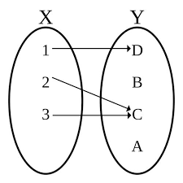

# Function
**Function in Discrete Mathematics**

In discrete mathematics, a function is a rule or relationship that assigns each element from one set (called the domain) to exactly one element in another set (called the codomain). Think of it as a mapping or a transformation.

More formally, a function $f$ from a set $A$ to a set $B$, denoted as $f: A \to B$, is a relation that satisfies the following two properties:

1.  **Totality:** For every element $a$ in $A$, there is an element $b$ in $B$ such that $f(a) = b$. In simpler terms, every element in the domain must be mapped to something in the co-domain.
2.  **Uniqueness:** If $f(a) = b$ and $f(a) = c$, then $b = c$. This means that each element in the domain is mapped to only one element in the co-domain.

**Key Components**

* **Domain ($A$):**
    * The domain is the set of all possible input values for the function.
    * It's the set from which the function takes its arguments.
    * In $f: A → B$, $A$ is the domain.
* **Codomain ($B$):**
    * The co-domain is the set of all possible output values for the function.
    * It's the set where the function's results are expected to reside.
    * In $f: A → B$, $B$ is the co-domain.
* **Range (or Image):**
    * The range is the set of all actual output values of the function.
    * It's a subset of the codomain.
    * The range consists of all $b$ in $B$ such that $f(a) = b$ for some $a$ in $A$.
    * The range is always a subset of the codomain.

**Illustrative Example**

Let's say we have:

* Domain ($A$) = $\lbrace 1, 2, 3\rbrace $
* Codomain ($B$) = $\lbrace A, B, C, D\rbrace $
* Function $f$:
    * $f(1) = D$
    * $f(2) = C$
    * $f(3) = C$

In this example:

* The domain is $\lbrace 1, 2, 3\rbrace $.
* The codomain is $\lbrace A, B, C, D\rbrace $.
* The range is $\lbrace D, C\rbrace $. Notice that $B$ and $A$ are in the codomain but not in the range because no element in the domain maps to them. Also notice that $a$ is in the range, even though it is the output of two domain inputs.
 

**Important Notes**

* A function must map each element of the domain to exactly one element of the codomain.
* The range is always a subset of the codomain, but it doesn't necessarily have to be equal to the codomain.
* Discrete mathematics often deals with functions that operate on finite or countable sets.